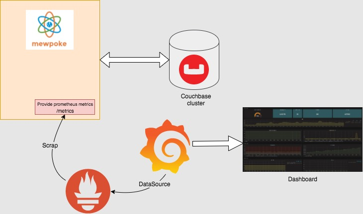
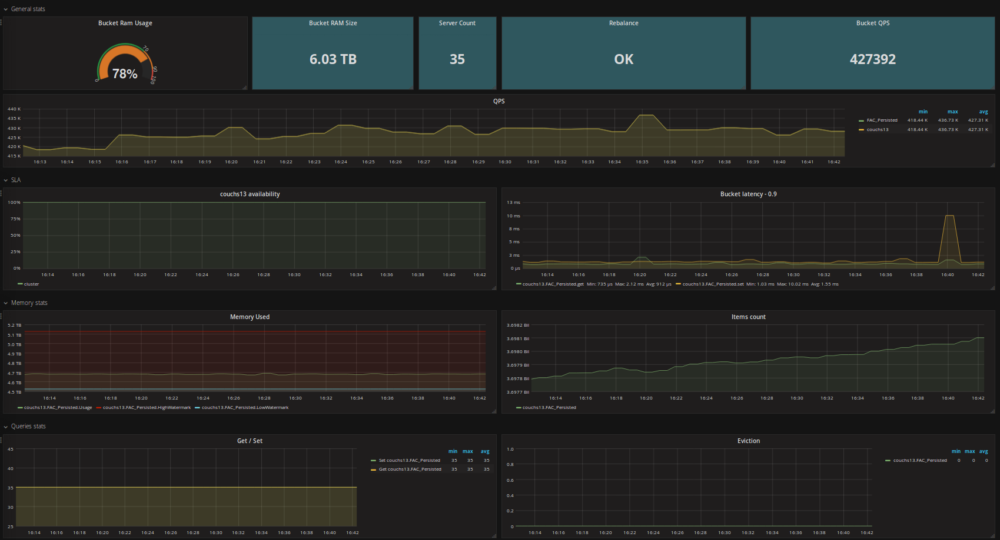

# MEWPOKE-ENVIRONMENT - Docker

Provide a docker environment to run mewpoke and get stats on grafana dashboard

<p align="center">
  
</p>

### Pre-requisites

- Install docker and docker-compose

### Included
- Couchbase: deploy cluster listening on port 8091 (login: Administrator / password)
- Mewpoke: deploy instances listening on port 8080, 8081, 8082 
- Prometheus: deploy instance / rules on port 9090
- Grafana: deploy grafana with prometheus datasource, and mewpoke dashboard (login: admin / password)

### Run
First build the uber jar at the top level of the repo:
```sh
gradle build
```
Then deploy containers:
```sh
cd docker
docker-compose up -d
```

After a couple of minutes connect to:
http://localhost:3000 and look at "Mewpoke Couchbase" dashboard
<p align="center">
  
</p>

